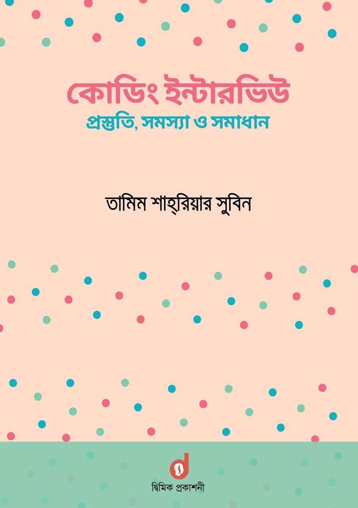

# কোডিং ইন্টারভিউ - প্রস্তুতি, সমস্যা ও সমাধান - তামিম শাহরিয়ার সুবিন

---
## Problem Solutions
#### Array and String

| # | Title | Solution | Leetcode |
|---| ----- | -------- | ---------- |
| 1 | [Remove Duplicates from Array](https://leetcode.com/problems/remove-duplicates-from-sorted-array/description/) | [C++](Solutions/1.Array_and_String/1.Remove_Duplicates_from_Array.cpp) | [C++](Solutions/0.Leetcode/26.remove-duplicates-from-sorted-array.cpp) |
| 2 | [Spiral Order Matrix](https://leetcode.com/problems/spiral-matrix/description/) | | |
| 3 | [Maximum Sum Contiguous Subarray](https://leetcode.com/problems/maximum-subarray/) | [C++] | [C++](Solutions/0.Leetcode/53.maximum-subarray.cpp) |
| 4 | [Max Distance](https://www.interviewbit.com/problems/max-distance/) | | |
| 5 | [Hotel Bookings Possible](https://www.interviewbit.com/problems/hotel-bookings-possible/) | | |
| 6 | [Maximum Unsorted Subarray](https://www.interviewbit.com/problems/maximum-unsorted-subarray/) | | |
| 7 | [Merge Overlapping Intervals](https://leetcode.com/problems/merge-intervals/)| | |
| 8 | [Merge Intervals](https://leetcode.com/problems/merge-intervals/)| | |
| 9 | [Grid Paths](https://leetcode.com/problems/unique-paths/) | | |
| 10 | [Array Search](https://leetcode.com/problems/search-insert-position/description/)| | [C++](Solutions\0.Leetcode\35.search-insert-position.cpp) |
| 11 | [Search for A Range](https://leetcode.com/problems/find-first-and-last-position-of-element-in-sorted-array/) | | |
| 12 | [Rotated Array Search](https://leetcode.com/problems/search-in-rotated-sorted-array/) | | |
| 13 | [Square Root](https://leetcode.com/problems/sqrtx/description/) | | [C++](Solutions\0.Leetcode\69.sqrtx.cpp) |
| 14 | [Power Function](https://leetcode.com/problems/powx-n/description/) | | |
| 15 | [String Compression](https://leetcode.com/problems/string-compression/description/) | | |
| 16 | [StrStr](https://leetcode.com/problems/find-the-index-of-the-first-occurrence-in-a-string/description/) | | [C++](Solutions\0.Leetcode\28.find-the-index-of-the-first-occurrence-in-a-string.cpp) |
| 17 | [String Rotation](https://leetcode.com/problems/rotate-string/description/) | | [C++](Solutions/0.Leetcode/796.rotate-string.cpp) |
| 18 | [Reverse String](https://leetcode.com/problems/reverse-string/description/) | | [C++](Solutions\0.Leetcode\334.reverse-string.cpp) |
| 19 | [Add Binary String](https://leetcode.com/problems/add-binary/description/) | | |
| 20 | [Power of 2](https://leetcode.com/problems/power-of-two/description/) | | |
| 21 | [Valid Number](https://leetcode.com/problems/valid-number/description/) | | |
| 22 | [Palindrome](https://leetcode.com/problems/valid-palindrome/description/) | | [C++](Solutions\0.Leetcode\125.valid-palindrome.cpp) |
| 23 | [Shortest Palindrome](https://leetcode.com/problems/shortest-palindrome/description/) | | |
| 24 | [Valid Anagram](https://leetcode.com/problems/valid-anagram/description/) | | [C++](Solutions\0.Leetcode\242.valid-anagram.cpp) |
| 25 | [All Anagram in a String](https://leetcode.com/problems/find-all-anagrams-in-a-string/description/) | | |

#### LinkedList
| # | Title | Solution | Leetcode |
|---| ----- | -------- | ---------- |
| | | | |
| | | | |
| | | | |
| | | | |
| | | | |
| | | | |
| | | | |
| | | | |
| | | | |
| | | | |
| | | | |

---

#### More Array
| # | Title | Solution | Leetcode |
|---| ----- | -------- | ---------- |
| | | | |
| | | | |
| | | | |
| | | | |
| | | | |
| | | | |
| | | | |
| | | | |

---

#### Stack & Queue
| # | Title | Solution | Leetcode |
|---| ----- | -------- | ---------- |
| | | | |
| | | | |
| | | | |
| | | | |
| | | | |

---

#### Recursion
| # | Title | Solution | Leetcode |
|---| ----- | -------- | ---------- |
| | | | |
| | | | |
| | | | |
| | | | |
| | | | |
| | | | |
| | | | |

---

#### Tree
| # | Title | Solution | Leetcode |
|---| ----- | -------- | ---------- |
| | | | |
| | | | |
| | | | |
| | | | |
| | | | |
| | | | |
| | | | |
| | | | |
| | | | |
| | | | |
| | | | |
| | | | |
| | | | |

---

#### Heap & Priority Queue
| # | Title | Solution | Leetcode |
|---| ----- | -------- | ---------- |
| | | | |
| | | | |
| | | | |

---
